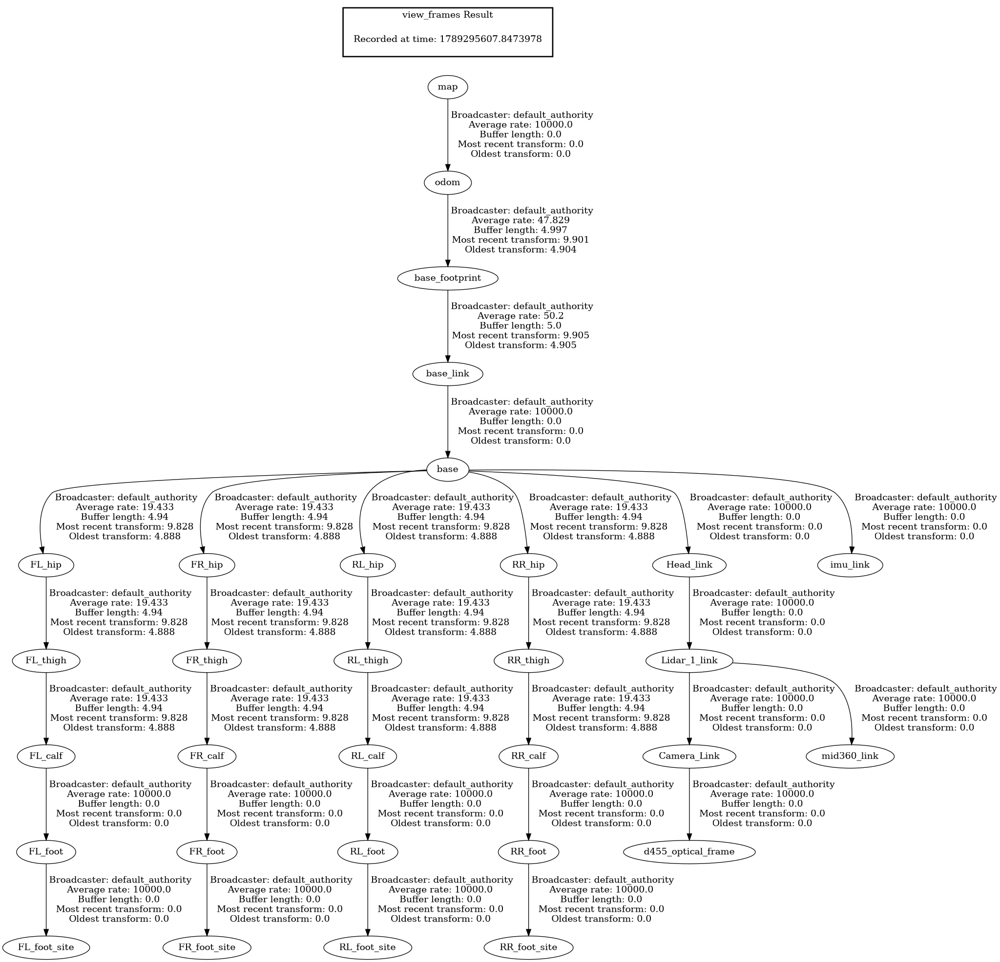

# M2 Quadruped ROS 2

## Overview

This repository provides a complete ROS 2 Jazzy integration for the custom **M2** quadrupedal robot using the [CHAMP](https://github.com/chvmp/champ) controller framework and Gazebo Sim Harmonic (v8).

The project unifies two distinct robot configurations in a single workspace:
1. **Sensor-Equipped Variant (Default)**: Full perception payload featuring a Livox Mid-360 3D LiDAR and an Intel RealSense D455 RGB-D depth camera mounted on a dedicated sensor head.
2. **Bare Variant**: Lightweight quadruped chassis without sensor payloads for baseline locomotion and benchmark testing.

The launch system automatically loads the corresponding URDF/Xacro description, tailored gait parameters (compensating for payload center-of-mass shift), and RViz visualization profile.

## About CHAMP Controller

CHAMP (Coupled Hybrid Automata for Mobile Platforms) is an open-source development framework designed for quadrupedal robots. It provides a hierarchical control system combining pattern modulation, inverse kinematics, and impedance control for efficient, stable locomotion.

## Features

- ✅ **Complete ROS 2 Jazzy & Gazebo Harmonic integration**
- ✅ **Dual Robot Configurations**:
  - **Sensors Variant**: Custom head mount, Livox Mid-360 3D LiDAR, and Intel RealSense D455 RGB-D camera
  - **Bare Variant**: Streamlined chassis without perception payloads
- ✅ **`ros2_control` Interface**: Effort-based torque control (`joint_group_effort_controller`) with position interface support
- ✅ **Perception & Sensor Streams**:
  - ✅ **Livox Mid-360 3D LiDAR**: 360° horizontal × 60° vertical FOV point clouds (`/mid360/points`)
  - ✅ **Intel RealSense D455**: RGB image (`/d455/image`), depth image (`/d455/depth_image`), camera point cloud (`/d455/points`), and camera info (`/d455/camera_info`)
  - ✅ **IMU**: High-rate orientation and angular velocity (`/imu/data`)
  - ✅ **Foot Contact Sensors**: Gazebo contact sensors on all 4 feet bridged to `champ_msgs/msg/ContactsStamped` (`/lf_foot_contacts`, `/rf_foot_contacts`, `/lh_foot_contacts`, `/rh_foot_contacts`)
  - ✅ **Ground-Truth Odometry**: Gazebo odometry publisher (`/odom/ground_truth`)
- ✅ **Dual-EKF State Estimation**: Fused local and global odometry via `robot_localization`
- ✅ **Dynamic Gait Profiles**: Configuration profiles tuned for payload distribution (`gait_sensors.yaml` with CoM offset vs `gait_bare.yaml`)
- ✅ **RViz Visualization**: Tailored RViz displays (`m2_sensors.rviz` and `m2_bare.rviz`)
- ✅ **Keyboard Teleoperation**: Smooth velocity commands via `teleop_twist_keyboard`
- ❌ **Nav2 Autonomous Navigation**: Planned / in development

---

## Transform (TF) Trees

### 1. Sensor-Equipped Variant (Default)

The complete kinematic, sensor payload, and localization transform tree:



* **Localization Chain**: `map` → `odom` → `base_footprint` → `base_link` → `base`
* **Sensor Head Chain**: `base` → `Head_link` → `Lidar_1_link`
  * `Lidar_1_link` → `mid360_link` (Livox Mid-360 optical center)
  * `Lidar_1_link` → `Camera_Link` → `d455_optical_frame` (RealSense D455 depth/RGB frame)
* **Leg Kinematic Chains**: `base` → `[FL|FR|RL|RR]_hip` → `_thigh` → `_calf` → `_foot` → `_foot_site`

### 2. Bare Variant

The baseline locomotion transform tree without perception payloads:


---

## System Requirements

- **Ubuntu 24.04 LTS**
- **ROS 2 Jazzy Jalisco**
- **Gazebo Sim Harmonic (v8)**

---

## Installation

### 1. Install ROS 2 & Gazebo Dependencies

```bash
sudo apt update
sudo apt install -y \
  ros-jazzy-ros-gz-sim \
  ros-jazzy-ros-gz-bridge \
  ros-jazzy-ros-gz-interfaces \
  ros-jazzy-gz-ros2-control \
  ros-jazzy-xacro \
  ros-jazzy-robot-localization \
  ros-jazzy-ros2-controllers \
  ros-jazzy-ros2-control \
  ros-jazzy-teleop-twist-keyboard
```

### 2. Build the Workspace

```bash
cd /home/robotics/navneeth/m2_ros2_champ/m2_ws
source /opt/ros/jazzy/setup.bash
colcon build --symlink-install
source install/setup.bash
```

---

## Usage

### 1. Launch Simulation & RViz

#### Default Launch (Sensors Enabled)
Launches the sensor-equipped M2 with Livox Mid-360 LiDAR, RealSense D455 camera, sensor bridges, `gait_sensors.yaml`, and `m2_sensors.rviz`:

```bash
source /opt/ros/jazzy/setup.bash
source install/setup.bash
ros2 launch m2_sim m2_launch.py
```

#### Bare Robot Launch (No Sensors)
Launches the bare M2 chassis with `gait_bare.yaml` and `m2_bare.rviz`:

```bash
ros2 launch m2_sim m2_launch.py sensors:=false
```

#### Selective Sensor Disabling
When running with `sensors:=true`, you can disable individual sensors if desired:

```bash
# Disable only Mid-360 LiDAR
ros2 launch m2_sim m2_launch.py disable_mid360:=true

# Disable only RealSense D455 camera
ros2 launch m2_sim m2_launch.py disable_d455:=true
```

#### Headless Mode
Run Gazebo and ROS without the GUI or RViz:

```bash
ros2 launch m2_sim m2_launch.py gui:=false rviz:=false
```

#### Joint Command Interface
By default, effort control is used (`joint_group_effort_controller`). Switch to position control via:

```bash
ros2 launch m2_sim m2_launch.py command_interface:=position
```

### 2. Teleoperation

In a separate terminal, drive the robot using keyboard commands:

```bash
source /opt/ros/jazzy/setup.bash
ros2 run teleop_twist_keyboard teleop_twist_keyboard
```

---

## Gait Parameters & Tuning

Gait parameters are isolated by configuration:
- **Sensors Model**: [`m2_sim/config/gait/gait_sensors.yaml`](m2_sim/config/gait/gait_sensors.yaml)
- **Bare Model**: [`m2_sim/config/gait/gait_bare.yaml`](m2_sim/config/gait/gait_bare.yaml)

| Parameter | Sensors Value | Bare Value | Description |
| :--- | :--- | :--- | :--- |
| `knee_orientation` | `">>"` | `">>"` | Knee bending direction (`>>`, `><`, `<<`, `<>`) |
| `com_x_translation` | `0.02` m | `0.0` m | Center of Mass offset (compensates for head/sensor payload) |
| `max_linear_velocity_x` | `0.3` m/s | `0.3` m/s | Maximum forward/reverse walking speed |
| `max_linear_velocity_y` | `0.25` m/s | `0.25` m/s | Maximum sideways walking speed |
| `max_angular_velocity_z` | `0.5` rad/s | `0.5` rad/s | Maximum turning speed |
| `stance_duration` | `0.28` s | `0.28` s | Contact duration per leg during a stride cycle |
| `swing_height` | `0.05` m | `0.05` m | Ground clearance during swing phase |
| `stance_depth` | `0.01` m | `0.01` m | Ground penetration compensation |
| `nominal_height` | `0.32` m | `0.32` m | Standing hip-to-ground target height |
| `odom_scaler` | `0.9` | `0.9` | Dead reckoning multiplier |

---

## Project Structure

```text
m2_ros2_champ/
├── champ/                 # Core kinematics solver and gait generator
├── champ_base/            # Controller nodes, state estimation, and EKF configs
├── champ_msgs/            # Custom CHAMP messages (ContactsStamped, Pose, etc.)
├── m2_application/        # Foot contacts bridge translating Gazebo contacts to CHAMP
├── m2_description/        # URDF/Xacro descriptions (bare & sensors), meshes, worlds
├── m2_sim/                # Launch files, gait/joint configs, RViz profiles
├── m2_tf_tree.png         # Transform tree for bare robot variant
├── m2_sensors_tf_tree.png # Transform tree for sensor-equipped robot variant
└── README.md              # Documentation
```

---

## Acknowledgements

* [CHAMP](https://github.com/chvmp/champ) - For the open-source quadruped control framework
