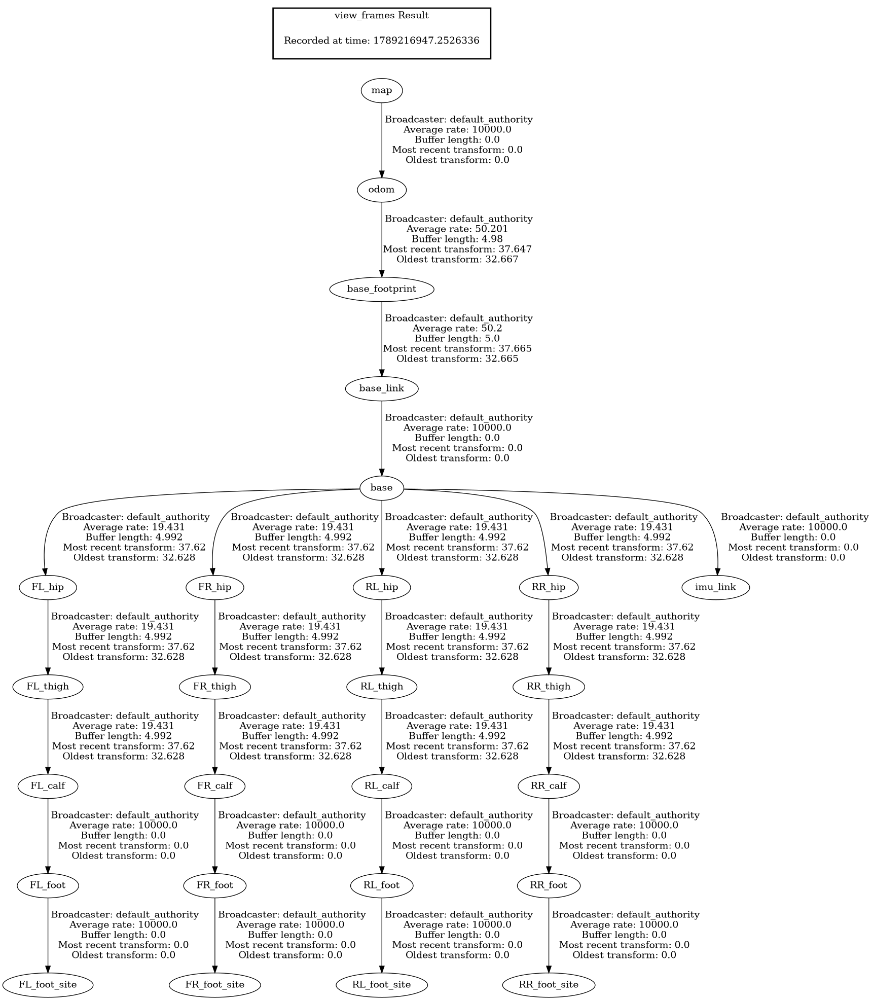

# M2 Quadruped ROS 2

## Overview

This repository provides a complete ROS 2 Jazzy integration for the custom **M2** quadrupedal robot using the [CHAMP](https://github.com/chvmp/champ) controller framework and Gazebo Sim Harmonic. It includes robot description models, `ros2_control` effort interfaces, simulation launch scripts, dual-EKF state estimation, and gait configuration.

## About CHAMP Controller

CHAMP (Coupled Hybrid Automata for Mobile Platforms) is an open-source development framework designed for quadrupedal robots. It provides a hierarchical control system combining pattern modulation, inverse kinematics, and impedance control for efficient, stable locomotion.

## Features

- ✅ **Complete ROS 2 Jazzy integration**
- ✅ **URDF & Xacro model** adapted to `ros2_control` effort hardware interface
- ✅ **Gazebo Sim Harmonic** simulation support
- ✅ **Keyboard teleoperation** (`teleop_twist_keyboard`)
- ✅ **RViz visualization** configured for visual CAD meshes and TF frames
- ✅ **Configurable gait parameters** (stance duration, swing height, nominal height = 0.32m)
- ✅ **Simulated Sensors & Estimation:**
  - ✅ IMU (`/imu/data`)
  - ✅ Foot contact sensors (`/lf_foot_contacts`, `/rf_foot_contacts`, `/lh_foot_contacts`, `/rh_foot_contacts`) bridged to `champ_msgs/msg/ContactsStamped`
  - ✅ Ground-truth odometry (`/odom/ground_truth`)
  - ✅ Dual EKF state estimation (`robot_localization`) for local and global odometry
- ❌ LiDAR & depth camera integration (in progress)
- ❌ Nav2 autonomous navigation (planned)

---

## Transform (TF) Tree

The complete kinematic and localization transform tree for M2 is shown below:



* **`map` → `odom`**: Provided by `static_transform_publisher`
* **`odom` → `base_footprint`**: Estimated by `footprint_to_odom_ekf` fusing raw odometry and IMU
* **`base_footprint` → `base_link`**: Estimated by `base_to_footprint_ekf` fusing pose and IMU orientation
* **`base_link` → `base`**: Standard REP-120 root link connection
* **`base` → Leg Links**: Published by `robot_state_publisher` and `joint_state_broadcaster`

---

## System Requirements

- **Ubuntu 24.04 LTS**
- **ROS 2 Jazzy Jalisco**
- **Gazebo Sim Harmonic (v8)**

---

## Installation

### 1. Install ROS 2 & Gazebo Dependencies

```bash
sudo apt update
sudo apt install -y \
  ros-jazzy-ros-gz-sim \
  ros-jazzy-ros-gz-bridge \
  ros-jazzy-ros-gz-interfaces \
  ros-jazzy-gz-ros2-control \
  ros-jazzy-xacro \
  ros-jazzy-robot-localization \
  ros-jazzy-ros2-controllers \
  ros-jazzy-ros2-control \
  ros-jazzy-teleop-twist-keyboard
```

### 2. Build the Workspace

```bash
cd /home/robotics/navneeth/m2_ros2_champ/m2_ws
source /opt/ros/jazzy/setup.bash
colcon build --symlink-install
source install/setup.bash
```

---

## Usage

### 1. Launch Gazebo Simulation & RViz

Launch Gazebo Sim with RViz and controller spawners:

```bash
source /opt/ros/jazzy/setup.bash
source install/setup.bash
ros2 launch m2_sim m2_launch.py
```

#### Headless Mode
To run without GUI or RViz (useful for automated testing or headless compute):

```bash
ros2 launch m2_sim m2_launch.py gui:=false rviz:=false
```

#### Joint Command Interface
By default, the effort interface is used (`joint_group_effort_controller`). You can select position control via:

```bash
ros2 launch m2_sim m2_launch.py command_interface:=position
```

### 2. Teleoperation

In a separate terminal, control the robot using your keyboard:

```bash
source /opt/ros/jazzy/setup.bash
ros2 run teleop_twist_keyboard teleop_twist_keyboard
```

---

## Tuning Gait Parameters

The gait configuration is located in [`m2_sim/config/gait/gait.yaml`](m2_sim/config/gait/gait.yaml):

| Parameter | Current Value | Description |
| :--- | :--- | :--- |
| `knee_orientation` | `">>"` | Knee bending direction (`>>`, `><`, `<<`, `<>`) |
| `max_linear_velocity_x` | `0.3` m/s | Maximum forward/reverse walking speed |
| `max_linear_velocity_y` | `0.25` m/s | Maximum sideways walking speed |
| `max_angular_velocity_z` | `0.5` rad/s | Maximum turning speed |
| `stance_duration` | `0.25` s | Contact duration per leg during a stride cycle |
| `swing_height` | `0.04` m | Ground clearance during swing phase |
| `stance_depth` | `0.01` m | Ground penetration compensation |
| `nominal_height` | `0.32` m | Standing hip-to-ground target height |
| `com_x_translation` | `0.0` m | Center of Mass offset compensation |
| `odom_scaler` | `0.9` | Dead reckoning multiplier |

---

## Project Structure

```text
m2_ros2_champ/
├── champ/                 # Core kinematics solver and gait generator
├── champ_base/            # Controller nodes, state estimation, and EKF configs
├── champ_msgs/            # Custom CHAMP messages (ContactsStamped, Pose, etc.)
├── m2_application/        # Foot contacts bridge translating Gazebo contacts to CHAMP
├── m2_description/        # URDF/Xacro robot description, CAD STL meshes, worlds
├── m2_sim/                # Launch scripts, gait/joint/link configurations, RViz config
├── m2_tf_tree.png         # Full transform tree generated via tf2_tools
└── README.md              # Documentation
```

---

## Acknowledgements

* [CHAMP](https://github.com/chvmp/champ) - For the open-source quadruped control framework
* [unitree_go2_ros2](https://github.com/khaledgabr77/unitree_go2_ros2) - Reference architecture for Gazebo Harmonic & ROS 2 Jazzy integration
